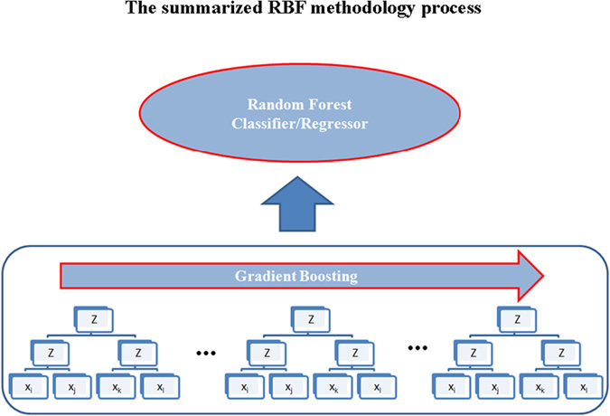

sklearn-compatible Random Bits Forest
===============

Scikit-learn compatible wrapper of the Random Bits Forest program written by 
[Wang et al., 2016](http://www.nature.com/articles/srep30086), available as a binary
on [Sourceforge](https://sourceforge.net/projects/random-bits-forest/). All credits 
belong to the authors. This is just some quick and dirty wrapper and testing code.

The authors present "*...a classification and regression algorithm called Random 
Bits Forest (RBF). RBF integrates neural network (for depth), boosting (for wideness) 
and random forest (for accuracy). It first generates and selects ~10,000 small 
three-layer threshold random neural networks as basis by gradient boosting scheme. 
These binary basis are then feed into a modified random forest algorithm to obtain 
predictions. In conclusion, RBF is a novel framework that performs strongly especially 
on data with large size.*"

Note: the executable supplied by the authors has been compiled for Linux, and for 
CPUs supporting SSE instructions. 



Usage
===============

Usage example of the Random Bits Forest:

```python
from uci_loader import *
from randombitsforest import RandomBitsForest
X, y = getdataset('diabetes')

from sklearn.ensemble.forest import RandomForestClassifier

classifier = RandomBitsForest()
classifier.fit(X[:len(y)/2], y[:len(y)/2])
p = classifier.predict(X[len(y)/2:])
print "Random Bits Forest Accuracy:", np.mean(p == y[len(y)/2:])

classifier = RandomForestClassifier(n_estimators=20)
classifier.fit(X[:len(y)/2], y[:len(y)/2])
print "Random Forest Accuracy:", np.mean(classifier.predict(X[len(y)/2:]) == y[len(y)/2:])
```

Usage example for the UCI comparison:

```python
from uci_comparison import compare_estimators
from sklearn.ensemble.forest import RandomForestClassifier, ExtraTreesClassifier
from randombitsforest import RandomBitsForest

estimators = {
              'RandomForest': RandomForestClassifier(n_estimators=200),
              'ExtraTrees': ExtraTreesClassifier(n_estimators=200),
              'RandomBitsForest': RandomBitsForest(number_of_trees=200)
            }

# optionally, pass a list of UCI dataset identifiers as the datasets parameter, e.g. datasets=['iris', 'diabetes']
# optionally, pass a dict of scoring functions as the metric parameter, e.g. metrics={'F1-score': f1_score}
compare_estimators(estimators)

"""
                          ExtraTrees F1score RandomBitsForest F1score RandomForest F1score
========================================================================================
  breastcancer (n=683)      0.960 (SE=0.003)      0.954 (SE=0.003)     *0.963 (SE=0.003)
       breastw (n=699)     *0.956 (SE=0.003)      0.951 (SE=0.003)      0.953 (SE=0.005)
      creditg (n=1000)     *0.372 (SE=0.005)      0.121 (SE=0.003)      0.371 (SE=0.005)
      haberman (n=306)      0.317 (SE=0.015)     *0.346 (SE=0.020)      0.305 (SE=0.016)
         heart (n=270)      0.852 (SE=0.004)     *0.854 (SE=0.004)      0.852 (SE=0.006)
    ionosphere (n=351)      0.740 (SE=0.037)     *0.741 (SE=0.037)      0.736 (SE=0.037)
          labor (n=57)      0.246 (SE=0.016)      0.128 (SE=0.014)     *0.361 (SE=0.018)
liverdisorders (n=345)      0.707 (SE=0.013)     *0.723 (SE=0.013)      0.713 (SE=0.012)
     tictactoe (n=958)      0.030 (SE=0.007)     *0.336 (SE=0.040)      0.030 (SE=0.007)
          vote (n=435)     *0.658 (SE=0.012)      0.228 (SE=0.017)     *0.658 (SE=0.012)
"""
```
